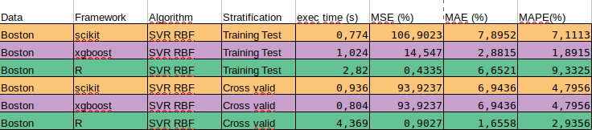

# MML Project

### Structure of the project 

To generate different machine learning program and to be able to add new frameworks or features easily, 
the architecture of our project uses several design patterns :

* Strategy : to change the language to generate
* Template Method : to generate every language in the same way. 
Define method to implement for the content of the program. only define method for write line of code
* Factory : to get the right Strategy

So, in the class MmlParsingJavaTest, which his used to parse the mml file and to create all the generated programs, 
we instantiate a Generator. In this Generator, we will set the right ``Strategy`` by using the ``Factory`` and the value of the algorithm from the mml file. Then we just have to configure the strategy with necessary values (model filepath...) 
and finally to execute the strategy to get the program with the desired framework.

Each ``Strategy`` has the same code structure, thanks to the Template ``Method pattern``, therefore in classes which generate code we just have to implement methods that write each parts of the code (imports, stratification, algorithm, print...) and not the structure around (put it all together for exemple).

This is an UML diagram showing the interaction between each design patterns : 
 

### Features

In this project the real difficulty was to create functional programs which uses those framework. 
Indeed, the lack of knowledge in machine learning or in these languages/framework was a brake for the development of this project.

We failed to create a program in Weka, but we were able to generate programs in this 3 frameworks :
* Scikit 
* XGBoost
* R
 
Here, XGBoost uses python to work, the structure of the program is the same as Scikit but some functions changes.
R also need many libraries to work, for each algorithm needed (Decision Tree, Random Forest...). We use ``Caret`` as framework for the machine learning. This libraries natively offers fucntions for Random Forest and SVR alogorithm. For the other algorithms we have to download appropriate libraries.

To use this program we must create .mml file
and change the variable ``path`` with the path to our .mml in the class ``MmlParsgingJavaTest`` (package org.xtext.example.mml.tests).
Then the program will parse the .mml and generate all desired programs.
Every results are then print in the console. Sorted from smallest to largest and with the exectution time for each program. 
The files containing these programs are put in the directory ``prog-gen`` (at the root of org.xtext.example.mml.tests) in a directory named with the current date.

Some program used for our tests are in a file named ``programmeMML``.

### Results

For our test with R we only use the dataset Boston.csv because x264.csv causes errors that we were unable to resolve.

During this tests to properly compare Scikit, Xgboost and Caret (R) we only used the algorithm Random Forst and SVR (with linear and rbf options).

#### Results with Random Forest : 

 
As we can see, whether it be in ``Cross validation`` or ``Training Test`` R has the best results.
But we can notice that R also needs a bigger execution time to work especially in cross validation : 17s against less than 1 second. 

XGBoost and Scikit have approximately the same execution time but XGBoost has better results mainly for ``Mean square error`` where its 8% against 11%.
 

#### Results with SVR Linear : 

Here, we can see that R has also the best results (in ``Cross validation`` or ``Training Test``) except for the ``Mean absolute percentage error`` where Scikit and XGBoost has pretty much the same values (2% against 5% for R). For the other metrics Xgboost has better result than Scikit.

We can also notice a pretty long time of execution for scikit and Xgboost in cross validation : 35s where R took only 4s.
But, in Training test, Xgboost has the best execution time (less than 1 second) where R took 3s and Scikit 9s.

#### Results with SVR RBF :

We can notice that Scikit has, in ``Training Test``, the best execution time (less than 1 second) but gets the worst values. 
Where XGBoost has the best results except for ``Mean squared error`` where R is better.

In ``Cross validation`` has better results than the 2 others but also has a longer time of execution (4s againt less than 1s).

Finally, with these tests we can conclude that in general R get the best results. 
Has we could it's depends on the algorithm used and the metric but R is more linear, his error values never was higher than 4 while Xgboost and Scikit has fluctuating results. 

But, in some cases Xgboost has better results than R and an execution time much shorter. 

And in general R has the biggest time of execution. 

To conclude, we suggest to use R if we need the best results no matter the execution time, but if we want to be quick Xgboost is the best choice in many cases. 
 
Moreover, XGboost's environment is much easier to set up. It can be use with Python which is pretty easy install.
R took much more time to install the environment and all the required libraries and the language is harder to handle and intended for people who know machine learning well.